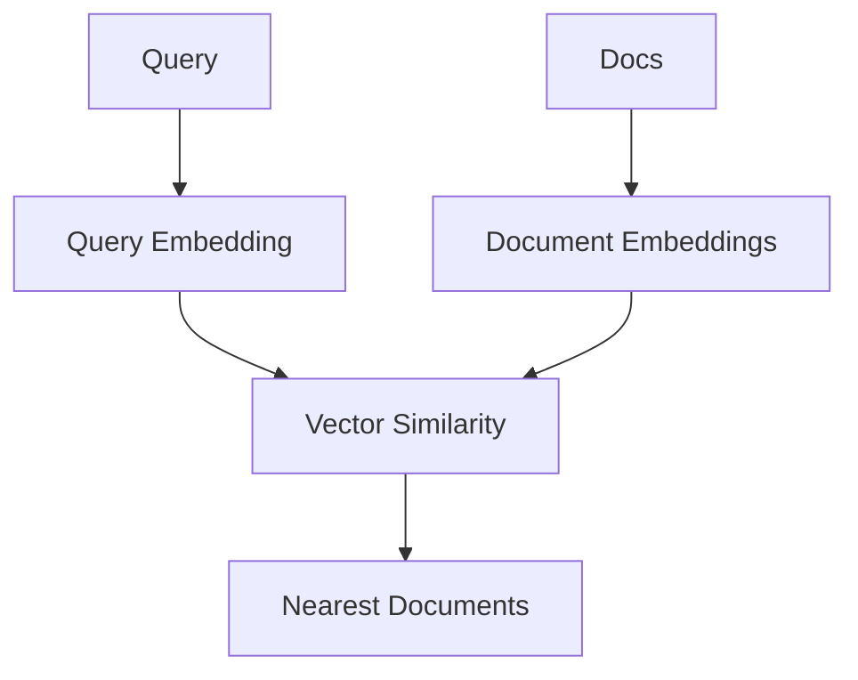
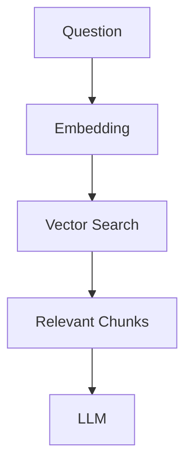

> **一句话理解：**Embedding Model 不负责长篇生成，它把文本、图片或其他对象映射成向量，使“相似”可以变成数学距离。

## 1. Embedding 是什么？

$$
f(x)=z\in\mathbb R^d
$$

一句话、图片或商品最终变成固定维度向量。

## 2. 相似度怎样计算？

常见 cosine similarity：

$$
cos(a,b)=\frac{a\cdot b}{\|a\|\|b\|}
$$

方向越接近，相似度越高。

## 3. 模型怎样学到语义空间？

常见 contrastive objective：

$$
L=-\log\frac{\exp(sim(q,d^+)/\tau)}{\sum_j\exp(sim(q,d_j)/\tau)}
$$

正样本拉近，负样本推远。

Embedding Model 因此是在学习一个**可检索的几何空间**。

## 4. RAG 为什么常用 Embedding？

Embedding 负责召回，LLM 负责阅读和生成。

## 5. Dense、Sparse 与 Hybrid

Dense embedding 依赖连续向量语义；BM25 等 sparse retrieval 更强调词项。

Hybrid search 可以组合：

$$
score=\lambda score_{dense}+(1-\lambda)score_{sparse}
$$

然后再使用 reranker。

## 6. Embedding、Reranker、LLM 的区别

| 模型 | 任务 |
| --- | --- |
| Embedding | 大规模快速召回 |
| Reranker | 精细比较 query-document |
| LLM | 生成与推理 |

生产级 RAG 经常同时使用三者。

## 7. 向量维度越高越好吗？

不一定。维度提高也会增加存储、带宽、索引和检索成本。

真正应该比较领域数据、语言覆盖、retrieval benchmark、dimension、latency 与 cost。

## 参考资料

1. Reimers & Gurevych, Sentence-BERT, 2019 — https://arxiv.org/abs/1908.10084
2. Karpukhin et al., Dense Passage Retrieval, 2020 — https://arxiv.org/abs/2004.04906
3. Radford et al., CLIP, 2021 — https://arxiv.org/abs/2103.00020
