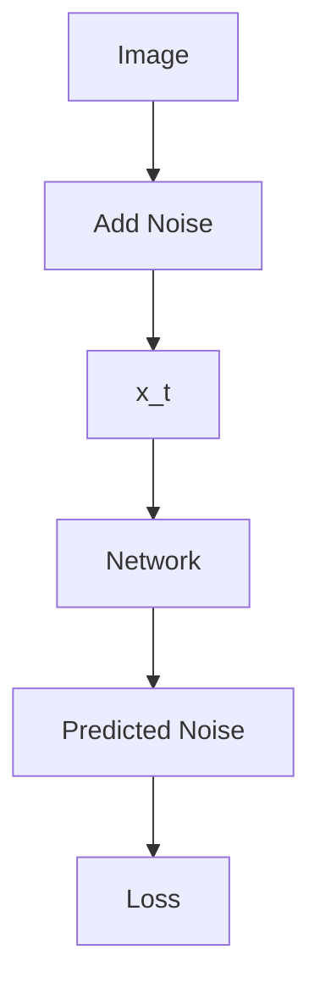
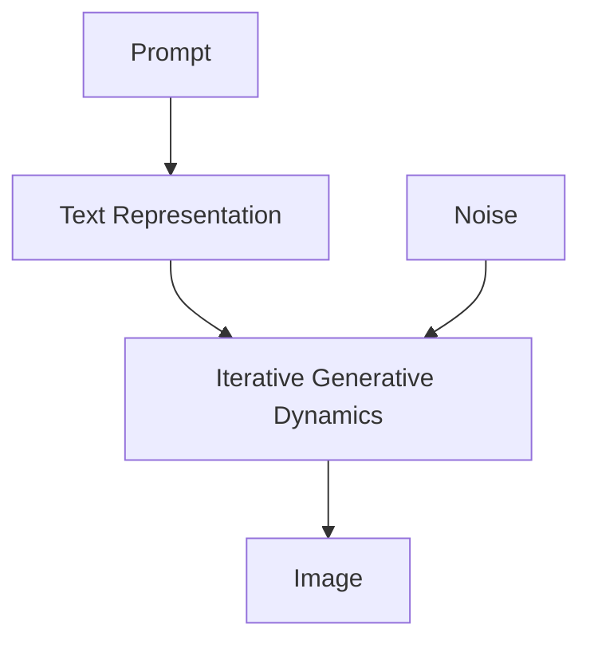
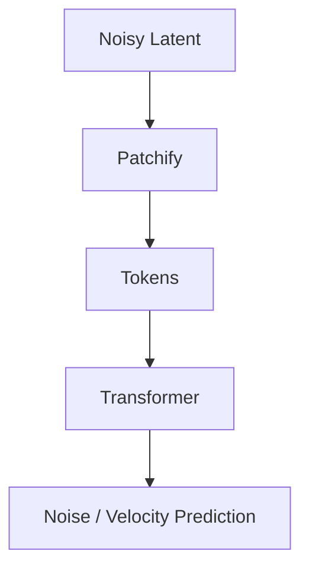
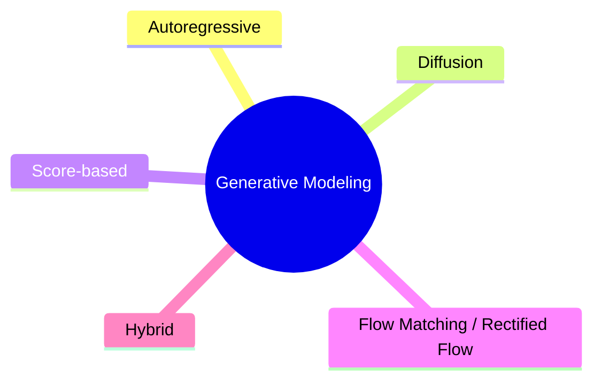
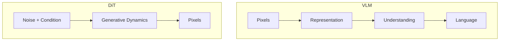

> **一句话理解：**Diffusion Model 学习如何把噪声逐步还原成数据；DiT 则把去噪网络的核心骨架推进到 Transformer。它是理解现代图像与视频生成的重要基础。

## 1. 生成模型在学什么？

给定真实数据分布 $p_{data}(x)$，生成模型希望学习 $p_\theta(x)$，从而能够采样出新的图像、音频或视频。

Diffusion 不一次生成完整图片，而是定义逐渐加噪的 forward process，再学习 reverse process。

## 2. Forward Diffusion

经典 DDPM：

$$
q(x_t|x_{t-1})=\mathcal N(\sqrt{1-\beta_t}x_{t-1},\beta_t I)
$$

利用重参数化，可直接写成：

$$
x_t=\sqrt{\bar\alpha_t}x_0+\sqrt{1-\bar\alpha_t}\epsilon
$$

其中 $\epsilon\sim\mathcal N(0,I)$。

## 3. 模型训练什么？

经典目标之一是预测加入的噪声：

$$
L=\mathbb E\left[\|\epsilon-\epsilon_\theta(x_t,t)\|^2\right]
$$

训练后从随机噪声开始执行反向过程，就可以逐步形成数据。

## 4. 文本怎样控制图片？

Prompt 先被 text encoder 编码为条件 $c$：

$$
\epsilon_\theta(x_t,t,c)
$$

Cross-Attention 等机制让去噪网络读取文本条件。

因此 text-to-image 更接近：

## 5. Latent Diffusion

直接在高分辨率 pixel space 扩散非常昂贵。

Latent Diffusion 先用 autoencoder：

$$
z=E(x)
$$

在 latent space 生成，再通过：

$$
\hat{x}=D(z)
$$

恢复像素。[2]

## 6. DiT 是什么？

DiT 把 diffusion backbone 改成 Transformer。[3]

这说明 Transformer 已经不只是语言模型骨架，也是现代视觉生成的重要通用计算结构。

## 7. Classifier-Free Guidance

常见 CFG：

$$
\hat\epsilon=\epsilon_{uncond}+w(\epsilon_{cond}-\epsilon_{uncond})
$$

更高 $w$ 通常强化 prompt 条件，但过高可能降低自然度和多样性。

## 8. Diffusion、Score 与 Flow

现代生成模型不都严格使用原始 DDPM。Flow Matching / Rectified Flow 学习从简单分布到数据分布的连续 vector field。

## 9. 与 VLM 的区别

理解模型与生成模型可以被同一个产品组合，但优化目标并不相同。

## 参考资料

1. Ho et al., DDPM, 2020 — https://arxiv.org/abs/2006.11239
2. Rombach et al., Latent Diffusion Models, 2021 — https://arxiv.org/abs/2112.10752
3. Peebles & Xie, DiT, 2022 — https://arxiv.org/abs/2212.09748
4. Lipman et al., Flow Matching, 2022 — https://arxiv.org/abs/2210.02747
