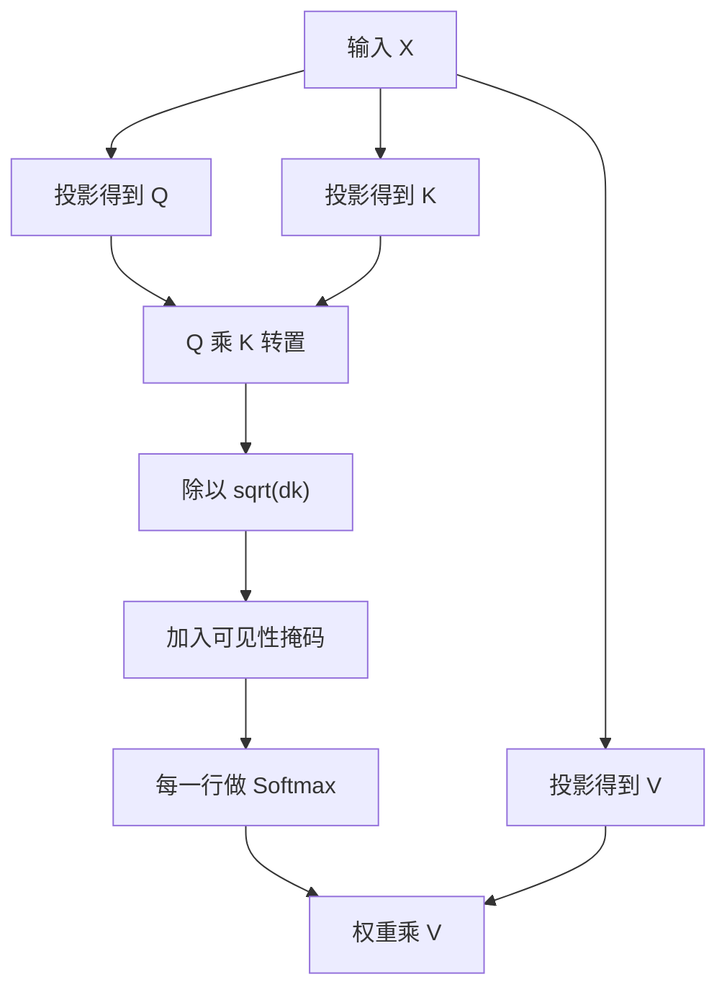

> **本页解决的问题**：给定输入表示，Attention 怎样逐步得到输出？每个矩阵的形状与每一行的含义是什么？
>
> 本页限定为一个缩放点积注意力头，采用因果掩码、无 dropout。数值为教学构造，不是商业模型权重，也不包含完整 Transformer 的所有层。先阅读 [Softmax](?view=garden&scope=branch:llm:math/softmax) 会更容易理解。

先读 [向量、张量与矩阵乘法](?view=garden&scope=branch:llm:math/tensor-shapes)，再把每个轴代入下方计算；[条件概率与自回归](?view=garden&scope=branch:llm:math/probability) 解释为何需要因果可见性约束。

## 1. 先约定对象与形状

设序列长度为 $n$、输入维度为 $d_{model}$，Query/Key 维度为 $d_k$、Value 维度为 $d_v$。忽略批次维，只观察一个头：

| 对象 | 形状 | 本页中的工作 |
| --- | --- | --- |
| $X$ | $n\times d_{model}$ | 当前层的输入表示 |
| $W_Q,W_K$ | $d_{model}\times d_k$ | 生成匹配空间中的表示 |
| $W_V$ | $d_{model}\times d_v$ | 生成被读取的信息 |
| $Q,K$ | $n\times d_k$ | 每个位置的查询与键 |
| $V$ | $n\times d_v$ | 每个位置的值 |
| $S,A$ | $n\times n$ | 匹配分数与归一化权重 |
| $O$ | $n\times d_v$ | 单头加权结果 |

投影为 $Q=XW_Q$、$K=XW_K$、$V=XW_V$。这与直接把 Token ID 当 Q/K/V 不同。Query 可以类比“当前读取的匹配条件”，但不是一个天然带有人类意图的问题句子。[1]



## 2. 构造一个能手算的例子

令 $n=3,d_k=d_v=2$：

$$
Q=K=\begin{bmatrix}1&0\\0&1\\1&1\end{bmatrix},\qquad
V=\begin{bmatrix}1&2\\3&4\\5&6\end{bmatrix}
$$

这些矩阵可以由 $X=I_3$，以及分别等于上述矩阵的投影权重产生。只是为了简化算术，并不是在建议真实模型用单位矩阵编码语言。

每行代表一个位置。比如 $q_3=[1,1]$，$k_1=[1,0]$，它们的点积是 $1\times1+1\times0=1$。

## 3. 第一步：为什么乘 K 的转置？

我们要让每个查询与每个键比较。$Q$ 是 $3\times2$，$K^T$ 是 $2\times3$，结果刚好是 $3\times3$：

$$
S=QK^T=\begin{bmatrix}1&0&1\\0&1&1\\1&1&2\end{bmatrix}
$$

$S_{ij}$ 表示位置 $i$ 的查询与位置 $j$ 的键的匹配分数。它不是 Token 概率，也不是余弦相似度：这里没有自动按向量范数归一化。

把 $QK^T$ 误写成 $Q^TK$，会得到 $2\times2$ 的矩阵，比较的对象就变了。形状检查不是形式主义，它能揭露计算含义是否正确。

## 4. 第二步：缩放为何出现？

将分数除以 $\sqrt{d_k}$。原论文用独立、零均值、单位方差的分量作为解释性假设，此时点积方差随 $d_k$ 增长，缩放让其量级更稳定。[1]

这不是说真实训练后所有 Q/K 分量都严格独立且方差为 1。不要把分析假设当作每层张量的测量结果。

本例除以 $\sqrt2$，所以分数 1 变为约 0.707107，分数 2 变为约 1.414214。

## 5. 第三步：因果掩码限制读取位置

标准自回归训练中，当前位置的表示用于预测下一个符号，可以读取自己及以前的输入，但不能读未来位置。[1]

$$
M_{ij}=\begin{cases}0,&j\le i\\-\infty,&j>i\end{cases}
$$

缩放再加掩码的结果为：

$$
\begin{bmatrix}
0.707107&-\infty&-\infty\\
0&0.707107&-\infty\\
0.707107&0.707107&1.414214
\end{bmatrix}
$$

掩码加在 Softmax 前面；非法位置的指数为零。若先计算 Softmax 再把非法位置清零而不重新归一化，合法权重的和通常不再是 1。

## 6. 第四步：按行归一化

$$
A=\operatorname{softmax}_{\text{row}}(S/\sqrt2+M)
\approx\begin{bmatrix}
1&0&0\\
0.330238&0.669762&0\\
0.248255&0.248255&0.503490
\end{bmatrix}
$$

第一行只能读取第一个位置，因此权重为 `[1,0,0]`。第二行在前两个位置之间分配权重。第三行对三个位置都可见。这里归一化维度是“同一查询能够读取的键”，不是对整个矩阵所有元素归一化。

行和为 1，是当前无 dropout 的教学设置下的验收条件。真实训练中若对权重施加 dropout，则不能直接要求每次随机计算后的行和仍为 1；具体算子行为需要按实现理解。[2]

## 7. 第五步：读取 V，而不是再读取 K

$$
O=AV\approx\begin{bmatrix}
1&2\\
2.339523&3.339523\\
3.510470&4.510470
\end{bmatrix}
$$

第三行第一个数来自 $0.248255\times1+0.248255\times3+0.503490\times5$。K 决定匹配，V 提供加权内容，二者不是必须相等。

这个 $3\times2$ 输出还不是词表上的概率，也不是最终答案。多头系统会将多个头的输出拼接并做输出投影，完整网络还包含残差、归一化、前馈层等；本例到单头结果为止。[1]

## 8. 可运行实验与“不能偷看未来”检查

```python
# nextchina-example: attention
import math

Q = [[1.0, 0.0], [0.0, 1.0], [1.0, 1.0]]
K = [row[:] for row in Q]
V = [[1.0, 2.0], [3.0, 4.0], [5.0, 6.0]]

def attention(q, k, v):
    n = len(q)
    if not n or len(k) != n or len(v) != n:
        raise ValueError("本例要求 Q/K/V 有相同且非零的行数")
    dk, dv = len(q[0]), len(v[0])
    if not dk or not dv:
        raise ValueError("维度不能为空")
    for rows, width in [(q, dk), (k, dk), (v, dv)]:
        if any(len(r) != width or not all(math.isfinite(x) for x in r) for r in rows):
            raise ValueError("矩阵形状或数值无效")
    scores = [[sum(a * b for a, b in zip(qi, kj)) for kj in k] for qi in q]
    weights = []
    for i, row in enumerate(scores):
        visible = [x / math.sqrt(dk) for x in row[:i + 1]]
        m = max(visible)
        exps = [math.exp(x - m) for x in visible]
        total = sum(exps)
        weights.append([x / total for x in exps] + [0.0] * (n - i - 1))
    output = [[sum(weights[i][j] * v[j][c] for j in range(n))
               for c in range(dv)] for i in range(n)]
    return scores, weights, output

scores, weights, output = attention(Q, K, V)
assert scores == [[1, 0, 1], [0, 1, 1], [1, 1, 2]]
assert output[0] == [1, 2]
assert abs(output[2][0] - 3.5104695304536615) < 1e-10
for i, row in enumerate(weights):
    assert abs(sum(row) - 1) < 1e-12
    assert all(x == 0 for x in row[i + 1:])
changed = [row[:] for row in V]
changed[2] = [100.0, -100.0]
assert attention(Q, K, changed)[2][:2] == output[:2]
assert attention(Q[:2], K[:2], V[:2])[2] == output[:2]
print([[round(x, 6) for x in row] for row in output])
```

预期输出为 `[[1.0, 2.0], [2.339523, 3.339523], [3.51047, 4.51047]]`。修改未来位置的 V 不影响前两行，这验证了本例的可见性约束，而不是验证整个语言模型的事实可靠性。

## 9. 计算量、内存与能力不是同一指标

显式构造 $n\times n$ 的分数与权重，需要二次增长的元素数；点积与加权值的计算分别约为 $O(n^2d_k)$、$O(n^2d_v)$。还没有把线性投影、其他头和网络层算进去。

FlashAttention 讨论的是通过分块和读写安排实现精确注意力，减少显存层级间的访问，并不意味着“取消了匹配的数学含义”。不能把显式教学实现的内存占用，当作所有优化内核的实际占用。[3]

注意力权重也不是完整因果解释。改变 Value、输出投影或后续层，都可能改变最终行为；需要控制变量和干预实验，而不只是看热力图。

怎样确定输入规模、基本操作，以及为什么要分开数准备、输出与辅助空间，可继续读[算法复杂度](?view=garden&scope=branch:llm:math/complexity)。

## 10. 继续进入相关分支

[QKV 分支](?view=garden&scope=branch:llm:mechanisms/attention/qkv) 保留更细问题的入口；[KV Cache](?view=garden&scope=branch:llm:inference/kv-cache) 解释为什么生成下一 Token 时能复用过去的 K/V。要判断模型效果，应查看 [能力评测](?view=garden&scope=branch:llm:rankings)，不能从一张结构图推出榜单名次。

## 来源与范围

[1] Vaswani 等，[Attention Is All You Need，第 3.2 节](https://arxiv.org/html/1706.03762v7#S3.SS2)。用于结构与缩放假设；矩阵数值与程序为本项目教学构造。

[2] [PyTorch scaled_dot_product_attention](https://docs.pytorch.org/docs/stable/generated/torch.nn.functional.scaled_dot_product_attention.html)。用于实现中的掩码与 dropout 边界。

[3] Dao 等，[FlashAttention](https://arxiv.org/abs/2205.14135)。用于计算与存储实现的区别。本页未声称任何特定硬件上的实际速度。
