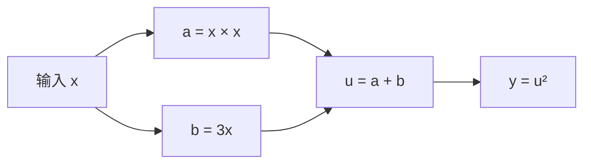

> **本页解决的问题**：一个输入经过多步运算后，怎样知道输出对它有多敏感？为什么自动微分能逐步求导，而有限差分只能提供数值核对？
>
> 前置知识是函数代入、平方、乘法与加法；本文会解释导数记号。理解多输入情形时，可先读 [向量与张量形状](?view=garden&scope=branch:llm:math/tensor-shapes)。本页只独立讲解导数、链式法则与自动微分；梯度怎样用于参数更新，继续复用 [训练循环](?view=garden&scope=branch:llm:training/loop)。

## 1. 导数描述一个点附近的变化

输入是函数 $f$ 和考察点 $x$，输出 $f'(x)$ 是局部变化率。对定义域内部的点，若以下双侧极限存在：

$$
f'(x)=\lim_{h\to0}\frac{f(x+h)-f(x)}{h},\qquad
f(x+\Delta x)\approx f(x)+f'(x)\Delta x
$$

第二式是小扰动下的一阶近似，不保证大幅改变输入时仍准确。函数值与导数是不同的数：值回答“输出多少”，导数回答“输入稍变，输出怎样变”。导数为零也不自动表示最小值，例如 $x^3$ 在零点的导数为零，却仍从负值增加到正值。

导数还依赖输入的单位。若改用新变量 $s$ 表示 $x=100s$，那么同一输出对 $s$ 的导数是对 $x$ 的导数的 100 倍。数值变大不表示模型突然更敏感；比较变化率前，应先对齐变量和尺度。

## 2. 把复合函数拆成计算图

选一个能手算、又包含分支的函数：

$$
a=x\times x,\quad b=3x,\quad u=a+b,\quad y=u^2=f(x)
$$



计算图中的箭头表示数值依赖。取 $x=1$，依次得到 $a=1,b=3,u=4,y=16$。同一个 $x$ 走了两条分支，求导时必须合并它们的贡献。

链式法则要求内外层在对应点可导：若 $y=g(u),u=k(x)$，则 $dy/dx=g'(k(x))k'(x)$。外层导数应在内层的**函数值**处求值。[1] 本例中：

$$
f'(x)=2(x^2+3x)(2x+3),\qquad f'(1)=2\times4\times5=40
$$

因此输入增加约 $0.001$ 时，输出增加约 $0.04$。忘记 $3x$ 分支，会误算成 $2\times4\times2=16$；这不是舍入误差，而是漏掉了依赖关系。

## 3. 沿图向前与向后传播

以下数值传播仍取 $x=1$。

**前向模式**从输入扰动出发。用点号表示对 $x$ 的导数，种子设为 $\dot x=1$：

$$
\dot a=x\dot x+x\dot x=2,\quad
\dot b=3\dot x=3,\quad
\dot u=\dot a+\dot b=5,\quad
\dot y=2u\dot u=40
$$

**反向模式**先计算函数值，再从输出敏感度回传。记 $\bar v=\partial y/\partial v$，令 $\bar y=1$，则 $\bar u=2u=8$，加法把它分别传给 $a,b$：$\bar a=\bar b=8$。最后汇总：

$$
\bar x=\bar a\,x+\bar a\,x+\bar b\,3=8+8+24=40
$$

$x\times x$ 的两个输入位置都依赖 $x$，所以贡献要加两次。也可以先把乘法写成 $a=pq$：固定 $q$ 时对 $p$ 的局部导数是 $q$，固定 $p$ 时对 $q$ 的局部导数是 $p$；再把 $p=q=x$ 的两条路径相加。这里的局部导数不能直接当成整个输出对原输入的导数。反向传播常见的“累加梯度”，在这里就是把多条路径相加；训练时如何管理梯度和优化器，见已有 [前向、损失、反向与更新](?view=garden&scope=branch:llm:training/loop)。

对多输入、多输出函数 $F:\mathbb R^n\to\mathbb R^m$，前向模式传播输入方向，计算 $Jv$；反向模式从输出权重传播，计算 $J^Tw$，其中 $J$ 是形状为 $m\times n$ 的偏导数矩阵；此处 $v\in\mathbb R^n$ 与 $w\in\mathbb R^m$ 采用列向量约定，需与张量形状页的行向量写法区分。[2] 一次方向传播不等于求出了整个矩阵。模式选择取决于需要哪些方向、输入输出维数和实现；反向还需保存或重算相关中间值。[2][3] 本例只有一个输入、一个输出，不能据此宣称某模式普遍更快或更省内存。

在每个基本标量运算及其求导规则都具有常数成本的简化模型下，含 $N$ 个运算的固定图，一次前向方向传播或一次反向遍历的算术工作量可按 $O(N)$ 估计。求整个偏导数矩阵需要更多方向；保存多少中间值、是否重算、怎样并行，仍决定实际时间和内存。本文没有测量这些工程成本。

## 4. 三种做法解决不同问题

手工解析求导可先展开 $f(x)=x^4+6x^3+9x^2$，得到 $4x^3+18x^2+18x$。自动微分则为乘法、加法等基本运算提供局部求导规则，并按计算依赖组合它们。[2][3] 它不需要把函数变成一条化简后的符号公式，也不靠反复扰动输入估计斜率。

中心有限差分只需两次函数求值：[4]

$$
D_hf(x)=\frac{f(x+h)-f(x-h)}{2h}
$$

它适合独立核对，但 $h$ 非零时通常不等于真正导数。对本例，直接展开可得 $D_hf(1)=40+10h^2$，所以 $h=0.1$ 时是 $40.1$。较小步长减少这项截断误差，却会让两个相近浮点数相减，放大舍入影响。[5] 在常见双精度浮点中，$1+10^{-20}$ 已舍入回 1，根本没有形成有效扰动。

因此要在多个合理步长上观察误差，按数值尺度设置绝对与相对容差；不能把“步长越小越正确”或一次检查通过当成定理。自动微分没有有限差分的步长误差，仍有浮点舍入、溢出和错误求导规则的风险。

## 5. 可运行的三路核对

以下仅用 Python 3 标准库。输入为有限的 `int/float`；布尔值、字符串、非有限数、溢出以及无效步长均报错。代码手工连接这个固定图的前向与反向规则，**不是通用自动微分引擎**。解析公式与图传播在安全点精确得到 40，有限差分在容差内一致。

```python
# nextchina-example: derivatives
import math

def finite_number(x):
    if isinstance(x, bool) or not isinstance(x, (int, float)):
        raise ValueError("只接受 int/float 实数，不接受布尔值")
    try:
        x = float(x)
    except OverflowError as exc:
        raise ValueError("数值超出浮点范围") from exc
    if not math.isfinite(x):
        raise ValueError("输入与中间结果必须有限")
    return x

def graph_values(x):
    x = finite_number(x)
    a, b = finite_number(x * x), finite_number(3 * x)
    u = finite_number(a + b)
    y = finite_number(u * u)
    return x, u, y

def value(x):
    return graph_values(x)[2]

def analytic_derivative(x):
    x = finite_number(x)
    return finite_number(4*x*x*x + 18*x*x + 18*x)

def forward_derivative(x):
    x, u, _ = graph_values(x)
    dx = 1.0
    da, db = x*dx + x*dx, 3*dx
    du = da + db
    return finite_number(2*u*du)

def reverse_derivative(x):
    x, u, _ = graph_values(x)
    bar_y = 1.0
    bar_u = bar_y * 2*u
    bar_a, bar_b = bar_u, bar_u
    return finite_number(bar_a*x + bar_a*x + bar_b*3)

def central_difference(x, h):
    x, h = finite_number(x), finite_number(h)
    if h <= 0:
        raise ValueError("步长必须大于零")
    plus, minus = finite_number(x+h), finite_number(x-h)
    if plus == x or minus == x:
        raise ValueError("步长太小，浮点输入未发生变化")
    numerator = finite_number(value(plus) - value(minus))
    denominator = finite_number(2*h)
    return finite_number(numerator / denominator)

x = 1.0
analytic = analytic_derivative(x)
forward, reverse = forward_derivative(x), reverse_derivative(x)
numeric = central_difference(x, 1e-5)
assert value(x) == 16.0
assert analytic == forward == reverse == 40.0
assert math.isclose(analytic, numeric, rel_tol=1e-9, abs_tol=1e-9)
assert math.isclose(central_difference(x, 0.1), 40.1)
assert forward_derivative(-1.0) == reverse_derivative(-1.0) == -4.0

bad_calls = [lambda v=v: value(v) for v in
             [True, "1", None, complex(1, 0), float("nan"),
              float("inf"), 10**1000, 1e200]]
bad_calls += [lambda h=h: central_difference(1.0, h) for h in
              [0, -1, True, "0.01", float("nan"),
               float("inf"), 1e-20, 1e200]]
for bad in bad_calls:
    try:
        bad()
    except ValueError:
        pass
    else:
        raise AssertionError("非法输入未被拒绝")
print("value:", value(x))
print("derivatives:", *(round(v, 6) for v in
                        (analytic, forward, reverse, numeric)))
```

预期两行输出为 `value: 16.0` 和 `derivatives: 40.0 40.0 40.0 40.0`。显示位数相同不代表底层浮点值相等。极大输入即使数学函数有定义，也可能超出本实现范围；极小量还可能下溢，本例不承诺全实数范围内的精度。

## 6. 不可导点不能靠核对消除

$|x|$ 在零点左导数为 $-1$、右导数为 $1$，普通双侧导数不存在，可中心差分始终得到零。如果框架也返回零，两者“通过核对”仍不能证明这里可导。ReLU 在零点同样需要具体实现的约定；框架给出的次梯度或其他指定值，不是让数学上的尖角消失。[3]

离散取整、参数相关分支和越过定义域的扰动也需要单独检查。自动微分沿实际计算规则传播，不能替你确认程序表达了正确模型。进行梯度检查时，应先选择可导、确定性的安全点，再检查数值尺度与边界。若两次求值更换了随机样本，差值还混入了随机变化，不能直接解释成输入扰动的效果。发现不一致时，先排查函数、求导路径、步长和精度，再判断是哪一项实现有问题。

**练习**：令 $x=-1$，计算函数值与导数，并分别给出经过 $a$ 和 $b$ 的反向贡献。若漏掉 $b$ 分支，会得到什么？

**答案**：$a=1,b=-3,u=-2,y=4$，$\bar u=-4$；两条分支分别贡献 $(-4)(-2)=8$ 与 $(-4)3=-12$，总导数为 $-4$。漏掉 $b$ 后误得 8，连变化方向也判断反了。

继续到 [Softmax 与温度](?view=garden&scope=branch:llm:math/softmax) 看归一化中的稳定性与求导，再到 [训练循环](?view=garden&scope=branch:llm:training/loop) 看求导结果怎样进入一次参数更新。

## 来源、核验日期与范围

[1] [OpenStax：Calculus Volume 1，The Chain Rule](https://openstax.org/books/calculus-volume-1/pages/3-6-the-chain-rule)：链式法则的可导条件、复合位置与推导。

[2] [JAX：Forward- and reverse-mode autodiff](https://docs.jax.dev/en/latest/jacobian-vector-products.html)：官方的 JVP、VJP 解释与模式关系。

[3] [PyTorch：Autograd mechanics](https://docs.pytorch.org/docs/stable/notes/autograd.html)：官方计算图、中间值保存和不可导点约定；访问时 stable 跳转至 2.14 文档。

[4] [PyTorch：Gradcheck mechanics](https://docs.pytorch.org/docs/stable/notes/gradcheck.html)：自动微分与中心差分核对的机制；访问时 stable 跳转至 2.14 文档。

[5] [Python：Floating-Point Arithmetic](https://docs.python.org/3/tutorial/floatingpoint.html)：浮点表示、舍入与近似比较的官方说明。

撰写与来源核验日期：2026-10-05。手算及代码为本项目教学构造；未进行框架性能测试、大模型训练或独立专家复核。审查状态保留 `needs-independent-review`；本篇不新增梯度或反向传播的独立覆盖认定。
