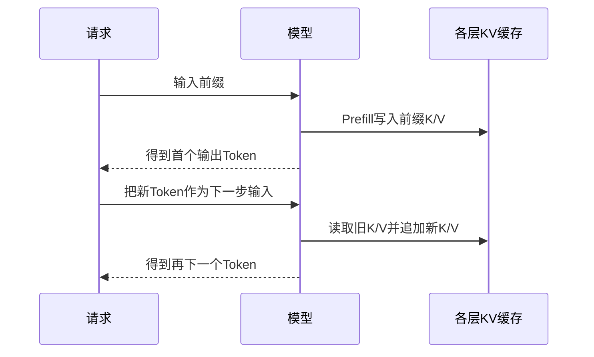

> **本页解决的问题**：生成下一 Token 时为什么可以复用过去的计算？KV Cache 缓存什么，显存如何估算，它与参数、长期记忆和 API 缓存有什么区别？
>
> 本页首先限定为固定权重、确定性推理、因果 Transformer 的常见 KV 实现。滑动窗口、潜在压缩、量化、分片和跨请求共享等设计，需要单独修正公式，不能从模型名称猜测配置。

## 1. 缓存的是运行状态，不是知识数据库

每层注意力会根据当前输入表示计算 Q、K、V。生成新位置时，新的 Q 需要读取以前位置的 K/V；已经计算过的旧 K/V 若仍有效，就没有必要每次重新生成。[1]

KV Cache 因而是某次序列计算的中间状态，不是训练权重，也不是用户长期记忆。它可以随请求结束而释放；复用缓存不等于模型学会了新的永久知识。

为什么通常不把旧 Q 一起保存为同类缓存？因为新的注意力输出需要的是“新查询 + 旧键和值”。旧查询对应的旧输出已经算过；具体系统可能另存其他状态，但常见 KV 缓存这个名字指的就是这组复用对象。

## 2. 为什么新 Token 不会反过来改变旧 K/V？

在因果掩码下，旧位置不能读取后来新增的位置。因此在模型权重、前缀、位置规则与推理设置相同的条件下，追加新输入不会让旧位置重新看见未来。

可以从层数做归纳：旧输入没有变；某层的旧状态只依赖可见旧状态；于是该层旧输出及其后续投影不变。这是缓存复用的机制理由，不是任何双向模型或任意修改前缀都能使用同一缓存的保证。

[Attention 教学计算](?view=garden&scope=branch:llm:mechanisms/attention) 中“追加或修改未来 V 不影响前两行”的断言，是这一可见性思想的局部演示。



第一枚输出通常来自 prefill 最后位置的 logits；这枚 Token 被送入下一次前向后，它自身的 K/V 才加入缓存。不能把“已经选出了 Token”和“该 Token 已通过所有层”混为一谈。

## 3. 一个 Token 的缓存读写

对单层、单个序列，旧缓存可记作 $K_{1:S},V_{1:S}$。新位置产生 $q_{S+1},k_{S+1},v_{S+1}$，然后：

$$
K'=[K_{1:S};k_{S+1}],\qquad V'=[V_{1:S};v_{S+1}]
$$

新的输出是：

$$
o_{S+1}=\operatorname{softmax}\left(\frac{q_{S+1}(K')^T}{\sqrt{d_k}}\right)V'
$$

对这个单步、没有 padding 的示意式，新位置可以读取全部有效前缀以及自己。真实批次需同时处理序列长度、位置索引和掩码；增量步骤的键长度与查询长度也不同。[1]

缓存避免重复计算旧位置的投影和中间状态，但**新查询仍然需要读取旧缓存**。上下文增大以后，访存与匹配成本仍会增长，不能把它描述成常数成本生成。

## 4. 从形状推导显存公式

若每层 K 和 V 都按 $B\times H_{kv}\times S\times d_h$ 保存，层数为 $L$、每个元素为 $b$ 字节，并且各层配置相同：

$$
M_{KV}=2BLH_{kv}Sd_hb
$$

| 符号 | 含义 | 不要混淆 |
| --- | --- | --- |
| 2 | K 和 V 两份 | 不是 FP16 的那个 2 |
| $B$ | 活跃且独立缓存的等长序列数 | 不一定等于网站注册用户数 |
| $L$ | 需要缓存的层数 | 不一定是所有架构的统一层数 |
| $H_{kv}$ | KV 头数 | 不一定等于 Query 头数 |
| $S$ | 已缓存的 Token 长度 | 不应自动等于声明的最大窗口 |
| $d_h$ | 每个 KV 头的维度 | 不是整个隐藏维度 |
| $b$ | 每元素实际存储字节 | 量化元数据可能另算 |

若活跃序列长度不同，基本求和式为 $2LH_{kv}d_hb\sum_i S_i$。若实现按最大长度预分配，则分配量可能比当前有效长度公式更大。[1]

## 5. 用明确假设算出数字

假设 $L=32,H_{kv}=8,d_h=128,b=2,B=1,S=8192$，并且无压缩、无跨请求共享：

$$
2\times1\times32\times8\times8192\times128\times2
=1{,}073{,}741{,}824\text{ 字节}=1\text{ GiB}
$$

固定其他条件，改变长度或 KV 头数：

| 配置 | 理论有效缓存 |
| --- | ---: |
| 8 个 KV 头、8192 Token | 1 GiB |
| 32 个 KV 头、8192 Token | 4 GiB |
| 1 个 KV 头、8192 Token | 0.125 GiB |
| 8 个 KV 头、131072 Token | 16 GiB |
| 上一行配置，4 条独立等长序列 | 64 GiB |

这是统一假设下的算术对比，不表示把已训练模型的 KV 头直接减少就会保留原质量。GQA 研究讨论了 Query 头分组共享 K/V 的模型与训练方案，应与单纯的缓存分配优化区分。[2]

## 6. 可运行的显存估算器

```python
# nextchina-example: kv-cache

def cache_bytes(layers, kv_heads, head_dim, element_bytes, lengths):
    dimensions = [layers, kv_heads, head_dim, element_bytes]
    if any(type(x) is not int or x <= 0 for x in dimensions):
        raise ValueError("层数、头数、维度、字节数必须为正整数")
    if not lengths or any(type(x) is not int or x < 0 for x in lengths):
        raise ValueError("需要非空的非负整数长度列表")
    return 2 * layers * kv_heads * head_dim * element_bytes * sum(lengths)

GiB = 2 ** 30
baseline = cache_bytes(32, 8, 128, 2, [8192])
assert baseline == GiB
assert cache_bytes(32, 32, 128, 2, [8192]) == 4 * GiB
assert cache_bytes(32, 1, 128, 2, [8192]) == GiB // 8
assert cache_bytes(32, 8, 128, 2, [131072] * 4) == 64 * GiB
assert cache_bytes(32, 8, 128, 2, [4096, 8192]) == baseline * 3 // 2
print(baseline, baseline / GiB)
```

预期输出 `1073741824 1.0`。这里使用二进制 GiB，不是十进制 GB；程序不探测设备、不猜模型参数，也不承诺部署成功。

## 7. 为什么“权重加缓存”还不是实际显存？

模型还需要运行时工作区、激活、算子临时内存、框架与分配器开销。有些系统预分配容量，有些使用块式管理；共享前缀可能减少实际存储，但不能在没有明确命中条件时预先扣除所有重复输入。

PagedAttention 的核心问题之一是缓存的内存管理与共享，不是把模型权重压缩成 KV。FlashAttention 主要涉及注意力计算的读写安排，也不等于取消跨步骤的 KV 存储。[3][4]

同一模型还可能存在不同层类型、滑动窗口、KV 量化、缓存卸载或分片。此时应按每层和每个设备分别核算，且把量化比例尺等元数据计入。上面的简单公式是基线，不是所有现代架构的万能公式。

## 8. 缓存什么时候失效？

修改已经缓存的前缀、模型权重或影响表示的位置设置，可能使旧缓存不再适用。不同请求之间共享时，还需要保证缓存键反映实际模型与前缀，遵循隔离与访问规则。

API 的“缓存输入价格”是服务商计量与计费规则；内部 KV Cache 是执行机制。二者有关联的可能，但不能直接画等号，也不能拿本页字节估算器推算商业账单。

进入 [API 报价](?view=garden&scope=branch:llm:pricing/offers) 和 [效率评测](?view=garden&scope=branch:llm:rankings/efficiency) 时，应保留服务商、请求长度、并发、输出长度等条件。速度与成本不是模型名称的一个固定常数。

## 9. 自检与下一步

为什么新 Q 仍要读取旧 K/V？为什么使用 Query 头数可能高估 GQA 缓存？为什么 1 GiB 不是整个推理进程的显存？为什么修改前缀可能让缓存失效？回答这些问题后，再进入 [缓存读写](?view=garden&scope=branch:llm:inference/kv-cache/read-write)、[显存形状](?view=garden&scope=branch:llm:inference/kv-cache/memory) 等分支做更细的实现与实验。

## 来源与范围

[1] [Hugging Face：Caching](https://huggingface.co/docs/transformers/en/cache_explanation)。用于增量缓存、形状与位置管理背景。

[2] Ainslie 等，[GQA](https://aclanthology.org/2023.emnlp-main.298/)。用于 Query/KV 头关系的研究背景。

[3] Kwon 等，[Efficient Memory Management for Large Language Model Serving with PagedAttention](https://arxiv.org/abs/2309.06180)。

[4] Dao 等，[FlashAttention](https://arxiv.org/abs/2205.14135)。

公式与表格是本页显式假设下的推导，不是任何具体商业模型、硬件或服务的实测报告。
