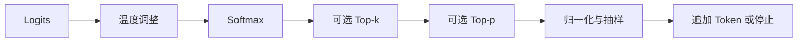

> **本页解决的问题**：概率分布已经有了，下一枚 Token 怎样选？Top-k、Top-p、温度和 Beam Search 分别改变哪一步？
>
> 本文使用自定的四候选分布和 Python 标准库，不调用模型，不声称这些参数可以保证真实性。资料已对照来源，尚待独立审核。

## 1. 输入、输出与边界

输入是长度为词表大小的 logits 向量，以及可选的温度、候选截断配置；输出可以是截断后的概率分布，之后才从中抽取 Token。贪心输出一个最高分候选；Beam Search 则在序列层维护多个前缀。[1][2]

温度作用于分数：$p_i=\operatorname{softmax}(z_i/T)$，这里要求 $T>0$。贪心是独立策略；某些 API 用零温度表示贪心，不等于可以在公式中除以零。Top-k 固定保留数量，Top-p 根据累计质量确定数量。它们不是训练、检索，也不更新模型参数。

## 2. 四项分布的手算

设概率为 $[0.50,0.25,0.15,0.10]$。Top-k 的 $k=2$ 留下 A、B，归一化后为 $[2/3,1/3,0,0]$。Top-p 的 $p=0.8$ 则必须保留 A、B、C：前两项累计只有 0.75，跨过阈值的 C 不能遗漏；归一化后为 $[5/9,5/18,1/6,0]$。

这个例子说明两者不等价。对尖锐分布，较小 Top-p 可能只留一个候选；对平坦分布，可能保留很多。截断后各候选概率之和仍为 1，但它已经不是原始完整分布。[1]

## 3. 顺序与停止条件

本文固定执行“温度 → Softmax → Top-k → 对剩余分布执行 Top-p → 再归一化”。这是明确的教学实现约定；实际库中还可能叠加重复惩罚、非法 Token 屏蔽等处理，不能只比较一个参数名。[2]

每次得到 Token 后，要追加到前缀，再计算下一步条件分布。达到 EOS、最大长度或外部停止条件才终止。单步概率高不能证明完整答案正确，改变随机种子也不构成事实核验。



## 4. 可运行实验

使用对数构造 logits，使第一组输入恰好对应上面的自定概率。并列候选按原始索引排序；$p=1$ 保留全部剩余候选。函数拒绝空向量、非有限输入、非法温度和越界截断参数。

```python
# nextchina-example: sampling
import math


def distribution(logits, temperature=1.0, k=None, p=1.0):
    if not logits or not all(math.isfinite(x) for x in logits):
        raise ValueError("finite non-empty logits required")
    if not math.isfinite(temperature) or temperature <= 0:
        raise ValueError("positive finite temperature required")
    if k is not None and (type(k) is not int or not 1 <= k <= len(logits)):
        raise ValueError("k must be an integer within the vocabulary")
    if not math.isfinite(p) or not 0 < p <= 1:
        raise ValueError("p must be in (0, 1]")
    maximum = max(logits)
    weights = [math.exp((x - maximum) / temperature) for x in logits]
    order = sorted(range(len(weights)), key=lambda i: (-weights[i], i))
    if k is not None:
        order = order[:k]
    total = sum(weights[i] for i in order)
    kept, cumulative = [], 0.0
    for i in order:
        kept.append(i)
        cumulative += weights[i] / total
        if p < 1 and cumulative >= p:
            break
    mass = sum(weights[i] for i in kept)
    output = [0.0] * len(weights)
    for i in kept:
        output[i] = weights[i] / mass
    return output


z = [math.log(x) for x in [0.50, 0.25, 0.15, 0.10]]
a = distribution(z, k=2)
b = distribution(z, p=0.8)
assert all(abs(x-y) < 1e-12 for x,y in zip(a, [2/3, 1/3, 0, 0]))
assert all(abs(x-y) < 1e-12 for x,y in zip(b, [5/9, 5/18, 1/6, 0]))
assert abs(sum(b)-1) < 1e-12
assert distribution([1, 1, 1], k=1) == [1.0, 0.0, 0.0]
assert distribution(z, temperature=0.5)[0] > distribution(z)[0]
print([round(x, 6) for x in a], [round(x, 6) for x in b])
```

## 5. Beam Search 为什么不同

考虑恰好两步的自定序列：第一步 A 为 0.6、B 为 0.4；A 后最优后继概率为 0.51，B 后最优后继概率为 0.99。贪心先选 A，最佳完整路径概率是 $0.6\times0.51=0.306$。保留两个前缀的 Beam Search 可以找到 B 路径，概率 $0.4\times0.99=0.396$。它优化的是序列评分，不是在单步分布中随机抽样。[2]

实际序列长度不同，还要处理 EOS、长度惩罚与搜索预算。Beam 更宽也不等于文本更真实、更有创造性；生成目标与业务质量需要分别评估。[1]

## 6. 如何复用和验证

同一个采样机制可复用于不同的自回归语言模型，但应记录词表、处理器顺序、停止规则和随机种子。验证时先检查归一化、阈值跨越、并列顺序和边界拒绝，再测试输出任务质量。不要把本文四项概率当作商业模型成绩。

继续阅读：[Softmax](?view=garden&scope=concept:softmax)、[温度](?view=garden&scope=concept:temperature)、[Beam Search](?view=garden&scope=concept:beam-search)、[评测协议](?view=garden&scope=concept:benchmark-protocol)。

## 来源

[1] Holtzman 等，The Curious Case of Neural Text Degeneration：https://arxiv.org/abs/1904.09751

[2] Hugging Face，Generation strategies：https://huggingface.co/docs/transformers/en/generation_strategies
