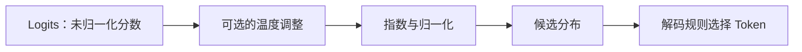

> **本页解决的问题**：Logits 怎样成为概率？温度改变了什么？为什么不能用输出概率证明一句话真实？
>
> 前置知识是指数、比例和向量。例子是自定的 4 项分数，不来自任何模型 API；程序使用 Python 3 标准库。

若概率分布还不熟悉，先读 [条件概率与自回归](?view=garden&scope=branch:llm:math/probability)；理解本页后，再用 [熵、交叉熵与 KL 散度](?view=garden&scope=branch:llm:math/objectives) 区分模型输出分布与训练目标。

## 1. Logits 不是概率

假设模型在一个教学词表上的分数是 $z=[2,1,0,-1]$。它们可以为负、不必和为 1，也没有“2 就是 200%”这种解释。

Softmax 定义为：

$$
p_i=\frac{\exp(z_i)}{\sum_{j=1}^{V}\exp(z_j)}
$$

每项为正，总和为 1。在语言模型输出头的语境里，它给出当前上下文下候选 Token 的分布；在注意力中，相同的数学运算通常是在可读取的位置之间分配权重。二者归一化的对象不同，不要看到 Softmax 就都解释成“答案概率”。[1]



## 2. 把四个数真正算一遍

| 候选 | Logit | $\exp(z_i)$，约值 | 概率，约值 |
| --- | ---: | ---: | ---: |
| A | 2 | 7.389056 | 0.643914 |
| B | 1 | 2.718282 | 0.236883 |
| C | 0 | 1 | 0.087144 |
| D | -1 | 0.367879 | 0.032059 |

分母约为 11.475217。表内概率由本页程序计算后四舍五入，不能再用这些截断值要求无限精度的和。

两个候选的概率比满足：

$$
\frac{p_i}{p_j}=\exp(z_i-z_j)
$$

因此分数差决定相对比例。给所有分数加同一个常数 $c$，分子分母都乘 $e^c$，结果不变。

## 3. 为什么实现时先减最大值？

直接计算 $e^{1000}$ 在常见浮点计算中会溢出，但 `[1000,999,998]` 的相对比例完全合理。令 $m=\max_i z_i$，改算：

$$
p_i=\frac{\exp(z_i-m)}{\sum_j\exp(z_j-m)}
$$

分子指数的输入均不大于 0，至少有一项为 $e^0=1$。这是代数等价的平移，不是改变模型偏好。浮点下仍有舍入和下溢，不能宣称“绝对无误差”；相关误差分析见 Blanchard、Higham 与 Higham 的研究。[2]

若一整行都被掩成 $-\infty$，则没有合法的归一化对象。正确做法是显式处理输入错误或遵循算子的约定，不能把它静默变成“均匀注意力”。

## 4. 温度改变分布，而不是训练参数

对正温度 $T$：

$$
p_i(T)=\frac{\exp(z_i/T)}{\sum_j\exp(z_j/T)}
$$

于是 $p_i(T)/p_j(T)=\exp((z_i-z_j)/T)$。对上述分数，降低温度扩大相对差距，升高温度缩小差距。

| $T$ | A 的概率，约值 | B 的概率，约值 | 解读 |
| ---: | ---: | ---: | --- |
| 0.5 | 0.864955 | 0.117059 | 更偏向最高分候选 |
| 1 | 0.643914 | 0.236883 | 原始 Softmax |
| 2 | 0.455054 | 0.276004 | 分布更平缓 |

当最高分唯一时，$T\to0^+$ 的极限集中到最高分项。若最高分并列，极限在这些最大项间分配；实际 greedy 解码还需要具体的并列处理规则。代码中不应真的除以零。“温度为 0”的产品设置通常需要按它自己的实现文档理解，不能代入这个公式硬算。

温度没有更新权重，没有引入新证据，也不保证解决事实错误。更高随机性不等于更有创造力，更低随机性也不等于更真实。

## 5. Top-k、Top-p 与温度分工不同

温度对保留候选的相对分数做连续调整；Top-k 按数量保留候选；Top-p 按累积概率选择候选集合，然后重新归一化。实现中的操作顺序需要明确。例如先缩放温度再做 Top-p，可能改变保留下来的集合。这里只说明数学角色，不假定所有服务都使用同一个顺序。

还要区分 **取最大值** 与 **按分布抽样**。分布相同，解码规则不同，最终输出也可以不同。比较模型时应记录解码设置，而不是把一次随机生成当作稳定能力测量。

## 6. 与交叉熵的连接

若正确候选索引为 $y$，单个目标的负对数似然为：

$$
L=-\log p_y=-z_y+\log\sum_j e^{z_j}
$$

其对 logits 的导数是：

$$
\frac{\partial L}{\partial z_i}=p_i-\mathbb{1}[i=y]
$$

把预测分布与 one-hot 目标相减，就得到 logits 这一层的梯度。它不是全部模型参数的梯度；还要通过链式法则继续向前传播。工程中提供“输入 logits”的交叉熵接口时，不要先手工 Softmax 再把概率当 logits 输入；应遵循算子契约。[3]

## 7. 可运行实验：稳定性、温度和有限差分

```python
# nextchina-example: softmax
import math

def softmax(z, temperature=1.0):
    if not z or not all(math.isfinite(v) for v in z):
        raise ValueError("需要非空、有限的分数")
    if not math.isfinite(temperature) or temperature <= 0:
        raise ValueError("温度必须有限且大于零")
    # 先相减，再除温度；避免把一个大公共偏移放大。
    m = max(z)
    exps = [math.exp((v - m) / temperature) for v in z]
    total = sum(exps)
    return [v / total for v in exps]

def nll(z, target):
    m = max(z)
    return (m - z[target]) + math.log(sum(math.exp(v - m) for v in z))

z = [2.0, 1.0, 0.0, -1.0]
p = softmax(z)
assert abs(sum(p) - 1) < 1e-12
assert abs(p[0] - 0.6439142598879724) < 1e-12
assert softmax([1000.0, 999.0, 998.0]) == softmax([2.0, 1.0, 0.0])
assert softmax(z, 0.5)[0] > p[0] > softmax(z, 2)[0]

target, eps = 1, 1e-5
for i in range(len(z)):
    plus, minus = z.copy(), z.copy()
    plus[i] += eps
    minus[i] -= eps
    numeric = (nll(plus, target) - nll(minus, target)) / (2 * eps)
    analytic = p[i] - int(i == target)
    assert abs(numeric - analytic) < 1e-8
print([round(v, 6) for v in p])
```

预期输出为 `[0.643914, 0.236883, 0.087144, 0.032059]`。有限差分验证的是这一个公式在这组输入附近的导数，不是证明整个训练系统正确。

## 8. 阅读概率时的三个边界

一项 Token 概率，是在给定上下文与候选集合下的模型输出分布；它不是一句命题经过事实核验的可信度。多个 Token 的联合概率也受长度与分词方式影响，不能不加条件地比较两个答案的概率乘积。

同样，某个注意力位置权重大，不足以单独证明“这个位置是最终答案的原因”；后面还有 Value、输出投影、残差及其他层。机制解释需要更具体的实验。

继续阅读 [Attention 的计算过程](?view=garden&scope=branch:llm:mechanisms/attention) 和 [一次训练更新](?view=garden&scope=branch:llm:training/loop)。需要比较真实模型时进入 [能力与评测](?view=garden&scope=branch:llm:rankings)，不要用本页教学分布代替榜单数据。

## 来源与范围

[1] Vaswani 等，[Attention Is All You Need，第 3.2、3.4 节](https://arxiv.org/html/1706.03762v7)。本页推导与四候选数字为教学计算。

[2] Blanchard、Higham、Higham，[Accurate Computation of the Log-Sum-Exp and Softmax Functions](https://arxiv.org/abs/1909.03469)。用于浮点稳定性背景。

[3] [PyTorch CrossEntropyLoss 文档](https://docs.pytorch.org/docs/stable/generated/torch.nn.CrossEntropyLoss.html)。用于 logits 输入契约；上面的代码不依赖 PyTorch。
