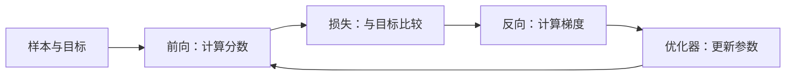

> **本页解决的问题**：“训练模型”在一次迭代中具体做了什么？目标、损失、梯度和参数更新怎样连接？
>
> 本页以自回归语言建模为背景，再用一个只有两个可训练参数的分类器手算更新。这个分类器不是完整 LLM；它只暴露训练循环的局部机制。Python 实验不需要 GPU、API 或第三方包。

前置阅读：[条件概率与自回归](?view=garden&scope=branch:llm:math/probability) 说明每个预测目标的条件；[熵、交叉熵与 KL 散度](?view=garden&scope=branch:llm:math/objectives) 给出本页损失的概率解释。

## 1. 先把输入和目标对齐

考虑教学符号序列：`BOS / 我 / 喜欢 / AI`。一个 next-token 训练样本可整理为：

| 计算位置的输入前缀 | 当前要预测的目标 |
| --- | --- |
| `BOS` | `我` |
| `BOS / 我` | `喜欢` |
| `BOS / 我 / 喜欢` | `AI` |

使用因果注意力时，一次前向可以同时计算这些位置，但每个位置不能读取对应目标及更晚的符号。目标移位与注意力掩码需要一起正确，不能因为训练数据已经完整可见，就允许模型读答案。[1]

工程中有些实现把标签移位封装在模型内部。因此使用接口时要确认契约，避免数据层移位一次、模型里又移位一次。[1]

## 2. 损失把“输出不好”变成一个数

给定参数 $\theta$ 和目标序列，自回归分解为：

$$
P_\theta(x_1,\ldots,x_N)=\prod_{t=1}^{N}P_\theta(x_t\mid x_{<t})
$$

相应负对数似然求和为：

$$
L_{sum}=-\sum_{t=1}^{N}\log P_\theta(x_t\mid x_{<t})
$$

实践中经常按有效目标 Token 数取平均，但应明确是求和、按样本平均，还是按 Token 平均。它们的尺度不同，不能在日志中随意比较。下面使用自然对数与单个样本，没有额外权重或标签平滑。[2]

正确目标的概率若从 0.1 升到 0.5，单项损失从约 2.302585 降到约 0.693147。这只说明这项训练目标拟合得更好，不是对事实真实性或综合智能的证明。

## 3. 梯度如何变成参数变化？

对于 Softmax 与单个 one-hot 目标，$\partial L/\partial z_i=p_i-y_i$。如果分数由 $z_i=w_i h$ 得到，且本例把上下文特征 $h$ 固定，那么：

$$
\frac{\partial L}{\partial w_i}=(p_i-y_i)h
$$

再用一次最简单的 SGD：

$$
w_i^{new}=w_i-\eta\frac{\partial L}{\partial w_i}
$$

完整神经网络会继续通过链式法则计算 $h$ 所依赖参数的梯度；本例故意不训练它，让每一步都能手算。



## 4. 一个完整数值更新

设置 $h=2$、$w=[0,0]$、目标类别为 0、学习率 $\eta=0.1$。

| 步骤 | 结果 |
| --- | --- |
| 初始 logits | $[0,0]$ |
| 初始概率 | $[0.5,0.5]$ |
| 初始损失 | $-\log0.5\approx0.693147$ |
| logits 梯度 | $[-0.5,0.5]$ |
| 参数梯度 | $[-1,1]$ |
| 更新后的参数 | $[0.1,-0.1]$ |
| 新 logits | $[0.2,-0.2]$ |
| 新的目标概率 | 约 $0.598688$ |
| 新损失 | 约 $0.513015$ |

梯度的负号并不意味着“错误越小”。它表示在这个点增大该参数会降低损失，所以减去负梯度会使参数增大。

## 5. 可运行实验：更新与梯度检查

```python
# nextchina-example: training
import math

h, target, rate = 2.0, 0, 0.1
weights = [0.0, 0.0]

def probabilities(w):
    z = [v * h for v in w]
    m = max(z)
    exps = [math.exp(v - m) for v in z]
    return [v / sum(exps) for v in exps]

def loss(w):
    z = [v * h for v in w]
    m = max(z)
    return m - z[target] + math.log(sum(math.exp(v - m) for v in z))

p = probabilities(weights)
gradients = [(v - int(i == target)) * h for i, v in enumerate(p)]
eps = 1e-5
for i in range(len(weights)):
    plus, minus = weights.copy(), weights.copy()
    plus[i] += eps
    minus[i] -= eps
    numeric = (loss(plus) - loss(minus)) / (2 * eps)
    assert abs(numeric - gradients[i]) < 1e-8

updated = [w - rate * g for w, g in zip(weights, gradients)]
assert gradients == [-1.0, 1.0]
assert updated == [0.1, -0.1]
assert loss(updated) < loss(weights)
assert abs(loss(updated) - 0.5130152523999526) < 1e-12
print(round(loss(weights), 6), round(loss(updated), 6))
```

预期输出 `0.693147 0.513015`。这里验证一次局部更新与有限差分一致。换成过大的学习率、复杂模型或不同数据，不保证每次训练损失都下降，更不保证验证集表现单调改善。

## 6. 真正训练还需要哪些约定？

批次决定一次估计使用哪些样本；梯度累积把多次前向/反向的结果合并后再更新。比较等效批次时，要记录平均方式、累积步数和设备数。若更新前没有按实现要求清理旧梯度，会把本来独立的迭代混在一起。

**Loss mask 与 attention mask 不同。** 某个位置不参与损失，不必然意味着模型不能读取该位置。例如指令微调可以将提示作为上下文，只在回答位置计算目标；“不计分”和“不可见”应分别配置。[1][2]

优化器状态、学习率调度、随机状态、数据进度和 tokenizer 配置共同影响恢复训练。只保存权重，未必能从中断位置继续同一条训练轨迹。这是本页提出的复现实验记录要求，而不是宣称所有框架自动保存同样信息。

## 7. 预训练、SFT、RLHF、DPO 的位置

预训练和监督微调可以采用相同的 token-level 预测形式，但数据和监督目标的范围不同。SFT 并不是只修改提示词；它涉及参数优化。Ouyang 等人的研究把演示数据微调与基于偏好反馈的后续优化连接起来，但其结果不能保证模型不再出错。[3]

DPO 使用偏好对构造优化目标，和“给每个正确 Token 做普通交叉熵”不是同一个目标。不能将 RLHF、DPO、LoRA 全部列成相互替代的同类算法：前两者涉及反馈与目标，LoRA 主要涉及哪些参数以怎样的形式进行适配。[4]

本页不展开每种后训练算法，也不把这个两参数例子称为完整 RLHF 实验。对应独立分支需要继续补齐数据、目标、假设与复现。

## 8. 为什么训练损失低不等于榜单高？

训练集与测试集不同，目标函数与评测任务也可能不同。模型可能记住训练样本，却在新问题上失败。困惑度还依赖 tokenizer、语料与平均口径；没有统一这些条件，单独比较数字并不可靠。

建议将训练记录与 [能力、评测与榜单](?view=garden&scope=branch:llm:rankings) 分开阅读：前者描述如何优化，后者描述在某个协议下测到了什么。这里不会把一次 loss 下降自动写成模型排名提升。

参数更新之外，[RAG](?view=garden&scope=hub:rag) 是把外部材料带入系统的一类方法，上下文学习则通过输入示例影响当前计算；它们都不应因为“给了新信息”就被误称为同一种训练。

## 9. 读完后的自检

解释为什么输入与标签要错开一个位置；区分梯度、参数与激活；亲自验证一次有限差分；指出哪个 mask 控制可见性、哪个 mask 控制计分；最后说明为何训练成功仍需独立验证集和任务评测。

继续阅读 [Token 表示](?view=garden&scope=branch:llm:math/tokenization)、[Softmax 与交叉熵](?view=garden&scope=branch:llm:math/softmax)、[推理中的 KV Cache](?view=garden&scope=branch:llm:inference/kv-cache)。

## 来源与范围

[1] [Hugging Face：Causal language modeling](https://huggingface.co/docs/transformers/en/tasks/language_modeling)。用于因果语言建模和标签处理背景；具体接口可能随版本变化。

[2] [PyTorch CrossEntropyLoss](https://docs.pytorch.org/docs/stable/generated/torch.nn.CrossEntropyLoss.html)。用于 logits、有效目标和 reduction 契约。

[3] Ouyang 等，[Training language models to follow instructions with human feedback](https://arxiv.org/abs/2203.02155)。

[4] Rafailov 等，[Direct Preference Optimization](https://arxiv.org/abs/2305.18290)。

数值推导与标准库代码为本项目教学构造，未进行大型模型训练或商业 API 实测。
