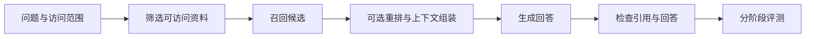

> **本页解决的问题**：RAG 如何把外部资料变成可检查的上下文？检索命中、引用有效、回答正确为何不是同一个指标？
>
> 本页使用人工指定向量与资料 ID，只验证检索和证据检查流程，不运行 Embedding 模型或 LLM。它不是生产 RAG，也不是商业效果评测。资料尚待独立审核。

## 1. 系统不是单个模型

RAG 将检索得到的资料与输入问题一起用于生成。Lewis 等的原始方案组合稠密检索器、向量索引和序列生成模型；后续工程实现可以改变检索与生成部件，不能由“RAG”这个名字推断固定供应商、重排器或数据库。[1][2]

系统输入应包括问题、知识库版本和访问范围；中间输出是候选资料及其来源；最终输出是回答和证据引用。本文建议把资料 ID、版本和评测结果一起保留，便于排查是哪一阶段出错。这是本项目的工程约定，不是原论文对所有 RAG 的强制定义。

## 2. 最小运行链



切块把资料分成检索单元，但必须保留来源和边界。向量检索比较的是表示空间中的相似度，不直接判断事实。重排是可选阶段；生成器可能忽略正确资料，或者把相似但不适用的资料当作依据。

因此“RAG `uses` Embedding”需要限定为稠密检索实现，“RAG `uses` 重排器”需要限定为启用重排阶段的系统。检索型系统不自动获得正确性保证。[1][2]

## 3. 把三种验收分开

本例有两个标注为相关的资料 a、b。Top-1 只返回 a，召回率为 $1/2$；Top-2 返回 a、b，召回率为 1。

$$
\operatorname{Recall@k}=\frac{|\text{retrieved@k}\cap\text{relevant}|}{|\text{relevant}|}
$$

若相关集合为空，本指标在本文约定中不适用，程序报错而不是伪造一个零。引用 ID 存在只表示可追溯，不表示该资料支持回答中的每个断言。回答是否受上下文支撑、是否回应问题，应另做评估；RAGAS 也区分上下文、忠实性和回答相关性。[3]

## 4. 可运行的检索与权限实验

向量是人为给定的二维数，不能解释为某个模型产生的语义向量。资料 secret 得分最高但不可访问，必须在召回前被排除。排序并列时按 ID 确定顺序。

```python
# nextchina-example: rag-evidence
import math


def retrieve(query, documents, k, allowed):
    if not query or not all(math.isfinite(v) for v in query):
        raise ValueError("finite non-empty query required")
    if type(k) is not int or k < 1:
        raise ValueError("positive integer k required")
    ids = [d["id"] for d in documents]
    if len(ids) != len(set(ids)):
        raise ValueError("duplicate document id")
    scored = []
    for doc in documents:
        vector = doc["vector"]
        if len(vector) != len(query) or not all(math.isfinite(v) for v in vector):
            raise ValueError("invalid document vector")
        if doc["id"] not in allowed:
            continue
        score = sum(a*b for a,b in zip(query, vector))
        if not math.isfinite(score):
            raise ValueError("non-finite score")
        scored.append((doc["id"], score))
    return [key for key,_ in sorted(scored, key=lambda item: (-item[1], item[0]))[:k]]


def recall_at_k(retrieved, relevant):
    if not relevant:
        raise ValueError("recall requires non-empty relevance labels")
    return len(set(retrieved) & set(relevant)) / len(set(relevant))


def citations_valid(citations, retrieved):
    return bool(citations) and set(citations).issubset(set(retrieved))


docs = [{"id": "a", "vector": [0.9,0.1]},
        {"id": "b", "vector": [0.8,0.2]},
        {"id": "c", "vector": [0.1,0.9]},
        {"id": "secret", "vector": [1.0,0.0]}]
allowed = {"a", "b", "c"}
one = retrieve([1,0], docs, 1, allowed)
two = retrieve([1,0], docs, 2, allowed)
assert one == ["a"] and two == ["a", "b"]
assert recall_at_k(one, {"a","b"}) == 0.5
assert recall_at_k(two, {"a","b"}) == 1.0
assert "secret" not in retrieve([1,0], docs, 4, allowed)
assert citations_valid(["a"], two)
assert not citations_valid(["missing"], two)
assert retrieve([1,0], docs, 2, set()) == []
print(two, recall_at_k(two, {"a","b"}))
```

## 5. 明确没有证明什么

这里没有调用生成器，不能据此声称回答忠实或没有幻觉。`citations_valid` 只检查 ID 是否来自检索结果，不进行语义蕴含判断，也不能发现资料本身过时。召回率为 1 也可能伴随大量噪声，需要结合排序、精确率和上下文预算检查。

权限筛选是本例的防泄漏约束；真实系统还要在重排、缓存、日志和生成上下文中保持相同权限边界。外部文档应被当作数据而不是高优先级指令。高风险用途应设置证据不足时的拒答和人工复核流程，而非让模型填补空白。

## 6. 如何继续完善

下一步应固定知识库版本、问题集、相关性标注、检索配置、生成模型和判分标准，分别记录候选命中、上下文支撑和回答质量。不能把不同版本、不同工具预算下的结果合成一个没有条件的总分。

继续阅读：[检索表示](?view=garden&scope=concept:embedding-model)、[向量索引](?view=garden&scope=concept:vector-index)、[证据归因](?view=garden&scope=concept:evidence-attribution)、[评测协议](?view=garden&scope=concept:benchmark-protocol)。

## 来源

[1] Lewis 等，Retrieval-Augmented Generation：https://arxiv.org/html/2005.11401v4

[2] Karpukhin 等，Dense Passage Retrieval：https://arxiv.org/abs/2004.04906

[3] Es 等，RAGAS：https://arxiv.org/html/2309.15217v1
