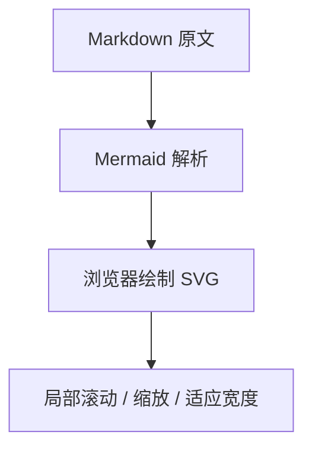

# 图示与无阴影控件

## 内容规则

流程图、时序图、甘特图等使用标准的 mermaid fenced code。text fenced code 始终是文字，不把任意箭头、代码或表格猜成图。

本次把 Models 中的流程、分支和模型谱系示意图从纯文本迁移到 Mermaid。数学公式、掩码矩阵和确实用于说明文本的代码块不作转换；文章的事实、来源和原有章节保持原有范围。

## 渲染与安全

MermaidDiagram 在接近阅读区时按需加载。全局队列将配置、parse 和 render 串行执行，避免多图或主题切换污染配置。严格安全模式不开放 Markdown 内任意 HTML/脚本。

失败时显示本地错误与原始源码，并提供重试；图表失败不阻断正文。源码用受控 button + aria-expanded，不再用浏览器原生 details/summary 控件。

## 控件与阴影

SpaceSelector 使用自绘 listbox，支持点击、上下方向键、Home/End、Enter、Escape、Tab 和名称前缀搜索。输入框与 GFM checkbox 保留语义，外观由 CSS 绘制。并非把语义 HTML 删除或改成 canvas。

侧栏、搜索框、代码/图表工具栏不使用阴影。flat-ui.css 全局禁止 box-shadow/text-shadow；Mermaid 内部 SVG filter 同样禁用。焦点通过实线 outline 表示，不使用阴影光圈。明亮与暗色主题使用各自的边框、底色和文字色。

## 可重复验收

npm run test:browser 在真正的 Chromium 中运行，不把 ReactDOMServer 生成占位元素当成图表渲染成功。

测试覆盖 Models 全部 Mermaid 图、九种图类型、多个视口、两种主题、错误恢复、源码开合、适应宽度、自绘侧栏大分类选择器、checkbox 外观、无阴影和页面横向溢出。样例测试页面只由开发服务器提供，不进入 dist 生产入口。

GitHub Actions 在部署前执行此测试。没有验证浏览器的图形行为时，不应宣称图示已完整验收。
