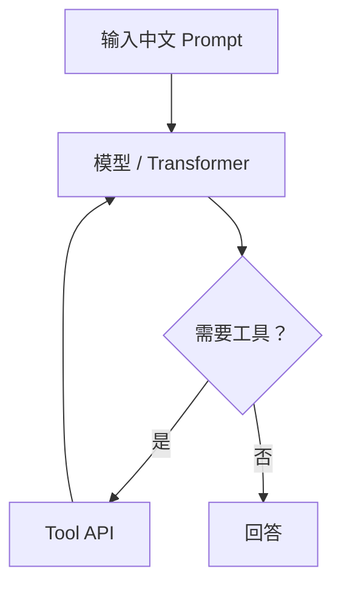
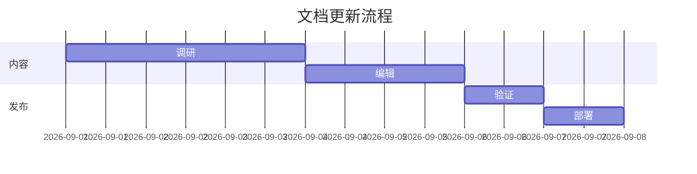
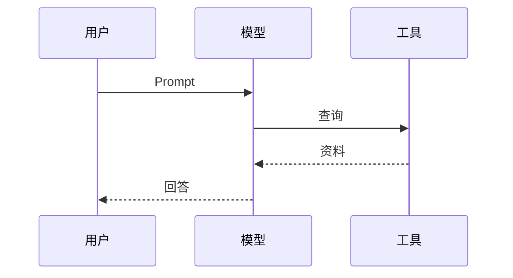
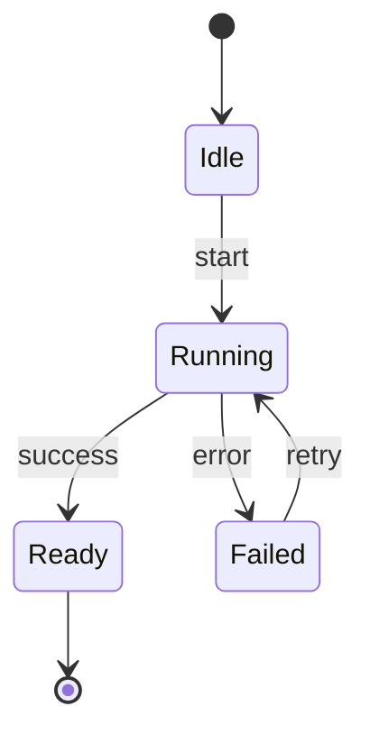
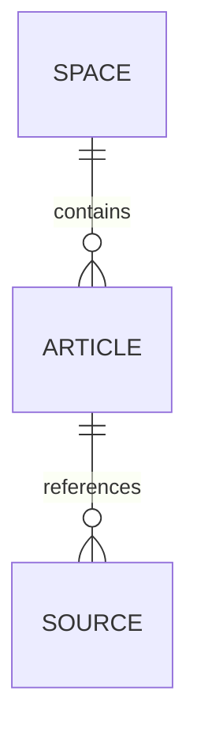
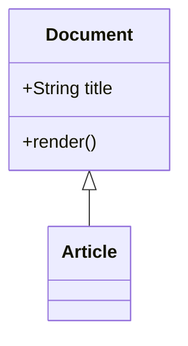
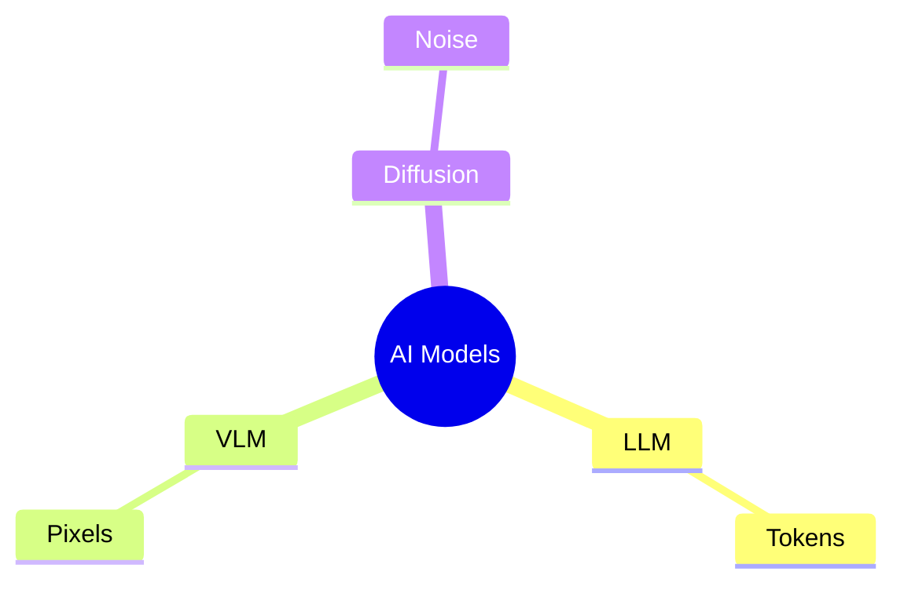
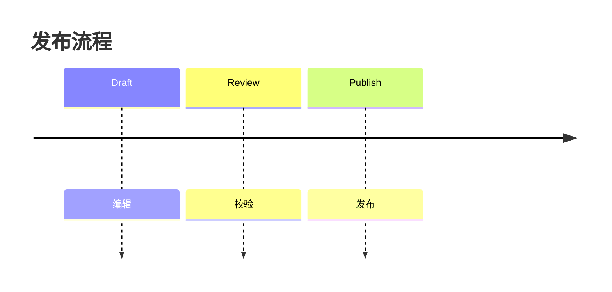
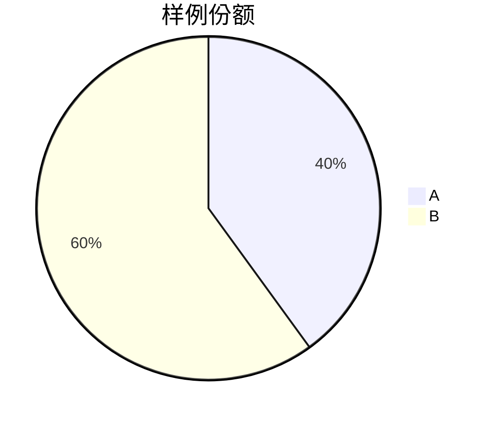

# 绘图回归样例

## 流程图


```mermaid
flowchart TD
  A["输入中文 Prompt"] --> B["模型 / Transformer"]
  B --> C{"需要工具？"}
  C -->|"是"| D["Tool API"] --> B
  C -->|"否"| E["回答"]
```

## 甘特图


```mermaid
gantt
  title 文档更新流程
  dateFormat YYYY-MM-DD
  section 内容
  调研 :a1, 2026-09-01, 3d
  编辑 :after a1, 2d
  section 发布
  验证 :2026-09-06, 1d
  部署 :2026-09-07, 1d
```

## 时序图


```mermaid
sequenceDiagram
  participant U as 用户
  participant M as 模型
  participant T as 工具
  U->>M: Prompt
  M->>T: 查询
  T-->>M: 资料
  M-->>U: 回答
```

## 状态图


```mermaid
stateDiagram-v2
  [*] --> Idle
  Idle --> Running: start
  Running --> Ready: success
  Running --> Failed: error
  Failed --> Running: retry
  Ready --> [*]
```

## 关系图


```mermaid
erDiagram
  SPACE ||--o{ ARTICLE : contains
  ARTICLE ||--o{ SOURCE : references
```

## 类图


```mermaid
classDiagram
  class Document {
    +String title
    +render()
  }
  Document <|-- Article
```

## 思维导图


```mermaid
mindmap
  root((AI Models))
    LLM
      Tokens
    VLM
      Pixels
    Diffusion
      Noise
```

## 时间线


```mermaid
timeline
  title 发布流程
  Draft : 编辑
  Review : 校验
  Publish : 发布
```

## 饼图


```mermaid
pie title 样例份额
  "A" : 40
  "B" : 60
```

- [x] 图表显示
- [ ] 保留未完成状态

```text
A → B（这是保留的代码示例，不应被自动猜成图）
```
