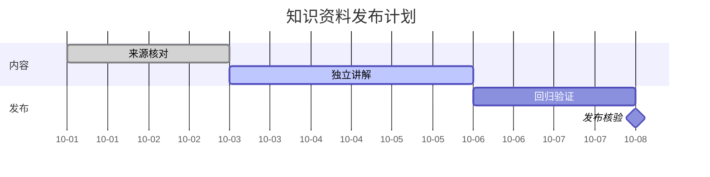

## 列表、公式与代码

文字中的 $d_{model}$、$Q=XW_Q$ 和 $\frac{a}{b}$ 保持行内排版，中文与 English 混合时也不插入小滚动条。

100. 第一项保留 Markdown 的起始编号，并允许较长的中文解释在窄屏内自然换行。
101. 第二项复用同一套数学 $n\times d_k$ 排版。

- 顶层列表有稳定的标记对齐，不使用全宽卡片。
  - 第二层保留清晰的缩进，并能容纳长路径 `src/components/MarkdownRenderer.tsx`。
    - 第三层继续阅读，不把正文挤成竖条。
      - 第四层的中文文本仍然应该拥有足够的可读空间。
- [x] 已完成的核验
- [ ] 待独立审核，不把程序测试当作审核

| 对象 | 形状 | 解释 |
| --- | --- | --- |
| $X$ | $n\times d_{model}$ | 当前层输入 |
| $Q,K$ | $n\times d_k$ | 查询与键 |

```python
# 数值运算，不执行用户输入
from math import exp
values = [1.0, 2.0]
print([exp(x) for x in values])
```

```unknown-language
<script>window.shouldNotRun = true</script>
```



