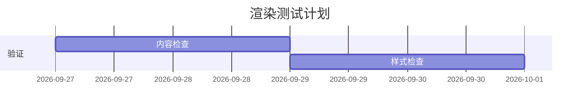

## 阅读体验：从概念到计算

普通正文应该清晰可读，**重点不靠大面积底色**，*强调保留语义*，~~删除内容仍能辨认~~。中文、English、`model.generate()` 与行内公式 $p_i=\frac{e^{z_i}}{\sum_j e^{z_j}}$ 可以一起阅读。

[查看资料](https://example.com/research "资料标题")，或阅读注释[^note]。

### 重复标题

标题锚点应当稳定，不因复制代码、切换主题而变化。

### 重复标题

> 引用区用于解释边界，并非另一篇正文。
>
> - 支持多段落和列表。
> - 第二项也应与标记对齐。

## 列表与任务

1. 一级有序列表。
   - 二级无序列表，含长标识符 `some_really_long_model_identifier_that_should_wrap_without_expanding_the_viewport`。
     - 第三级项目。
2. 列表中的段落不能挤在一起。

   这是第二段，它保留正常的段落间隔。

新的列表单独保留起始编号。

100. 大编号仍保留原始起始编号。
101. 下一个编号。

- [x] 紧凑任务：完成样式。
- [ ] 多行任务：这是一条很长的任务说明，用于检查两行文字与复选框是否对齐。
- 普通条目与任务条目混排，不应丢掉圆点。

- [ ] 宽松任务。

  第二段解释，复选框在段落内部也要正确对齐。

## 表格

| 概念 | 说明 |
| :--- | :--- |
| Token | 离散输入单元。|
| Attention | 这里用一段较长文字，确认两列表格在手机上能自然换行，而不需要整页横向滚动。|

| 名称 | 类型 | 说明 |
| :--- | :---: | :--- |
| 示例 A | 文本 | 多行描述不会无限拉宽一列。|
| 示例 B | 图像 | 每一列宽度应当可预测。|

| 模型 | 分数 | 延迟 | 说明 |
| :--- | ---: | ---: | :--- |
| Example model with a very long name | 95.5 | 120 | 仅用于渲染测试，不是真实测评数据。|
| 示例 B | 88 | 64 | 多行说明的格式应稳定。|

| 序号 | 名称 | 分数 | 供应方 | 上下文 | 输入 | 条件 |
| ---: | :--- | ---: | :--- | ---: | ---: | :--- |
| 1 | Example model with a long name | 95.5 | Example Lab | 128000 | 0.25 | 在宽表内换行，不得撑大页面。|
| 2 | 示例模型 B | 88 | 示例实验室 | 64000 | 0.5 | 表格自身允许横向滚动。|

## 代码与图示

```typescript
const answer = await model.generate({ prompt: 'Very long code line to test the horizontal scrollbar without increasing the article or document width.' });
```

```
没有语言标签的代码块也必须有复制与换行按钮。
```

    indented_code_should_also_work()




## 数学

$$
\operatorname{Attention}(Q,K,V)=\operatorname{softmax}\left(\frac{QK^\top}{\sqrt{d_k}}+M\right)V
$$

$$
\begin{bmatrix} 1 & 2 \\ 3 & 4 \end{bmatrix}
$$

## 图片


---

[^note]: 注释需要保留返回正文的链接，而不是重新生成另一个 ID。
